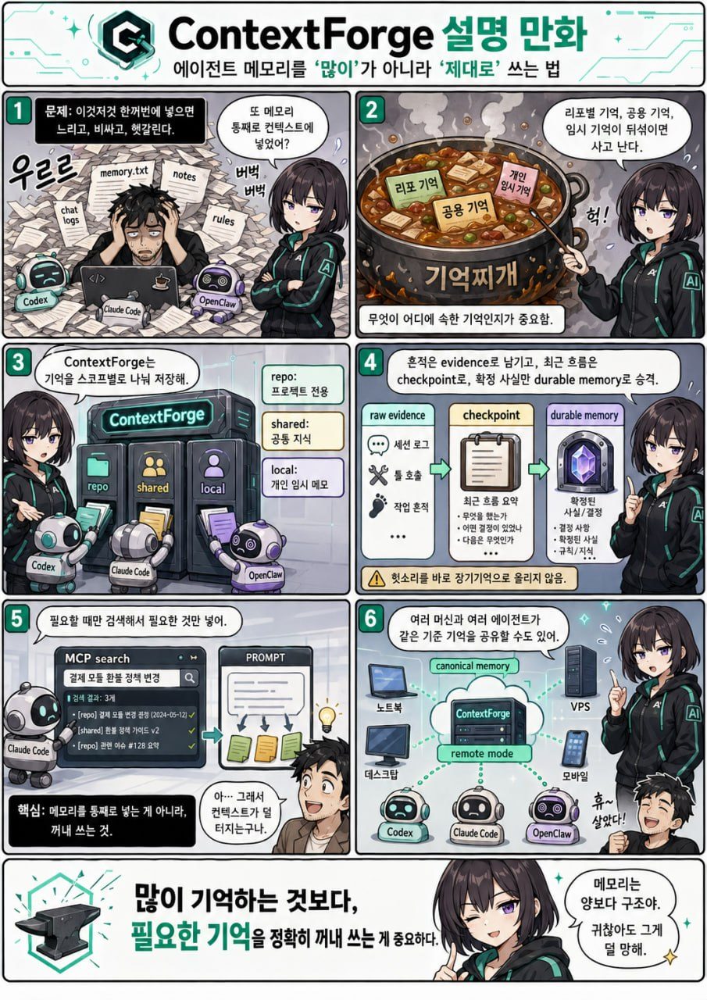

# ContextForge 전체 참조

코딩 에이전트를 위한 셀프호스트 메모리와 디스틸 런타임.

[English README](../README.md)

ContextForge는 단순한 메모리 파일이 아니다. Codex, Claude Code, OpenClaw
같은 에이전트가 프로젝트별 기억을 안전하게 공유하고, 대화 증거를 보존하며,
LLM으로 최근 작업 상태를 checkpoint로 압축해 다음 에이전트가 이어받을 수
있게 만드는 사이드카 런타임이다.

현재 package version: `0.5.1`



## 핵심 개념

- `memory`: 검토 후 승격된 durable memory. 안정적인 정책, 계약, runbook,
  결정, 반복되는 선호를 저장한다.
- `checkpoint`: raw evidence를 LLM이 압축한 최근 handoff 상태. 신뢰할 수
  있는 최근 메모지만, branch, PR, CI 같은 live state는 다시 확인해야 한다.
- `memory_candidate`: checkpoint에서 나온 승격 후보. 검토 자료일 뿐 자동으로
  durable memory가 되지 않는다.
- `raw evidence`: user/assistant 대화 증거. 디스틸 실패가 나도 삭제하지 않는다.
- `working summary/context`: 현재 세션의 mutable resume state. durable
  memory가 아니다.

행동할 때의 신뢰 순서는 다음과 같다.

```text
live source > durable memory > checkpoint handoff > memory_candidate
```

## 0.5.1에서 좋아진 점

- thread/repo 주기 checkpoint consolidation과 memory lifecycle 가시성.
- structured checkpoint handoff와 mutable live-state 재검증 힌트.
- durable distill/audit job, provider concurrency control, retry fencing.
- bounded indexed retrieval, Unicode/한국어 lexical search, cursor pagination,
  embedding lifecycle inventory/GC.
- MCP tool profile, capability·scope API token, readiness/metrics, 검증된
  backup/restore, deterministic offline memory-quality gate.

## 0.5.0에서 좋아진 점

- checkpoint가 사람용 요약뿐 아니라 구조화된 handoff payload를 저장할 수 있다.
- `bootstrapContext`와 `syncResumeContext`가 검색 결과와 별개로
  `handoff.latestHandoff`를 제공한다.
- `structured.liveState`에는 repo, branch, PR, head commit, CI, worktree
  같은 mutable state와 재검증 힌트를 담을 수 있다.
- memory candidate v2 필드인 `durabilityReason`, `riskReason`,
  `evidenceRefs`, `suggestedAction`을 보존한다.
- 자동승격 감사는 distill 모델과 분리된다. `codex_exec` 또는
  `codex_sdk_python` 감사 provider를 사용할 수 있다.
- agent adapter registry가 Codex, Claude Code, OpenCode, Grok, Cursor CLI
  5종 built-in adapter를 제공한다. 새 에이전트는 registry에 추가하는
  방식으로 확장한다.

## 권장 구조

여러 머신이나 여러 에이전트가 같은 기억을 공유해야 한다면 remote mode를
권장한다.

```text
Codex / Claude Code / OpenCode / Grok / Cursor CLI
          |
      MCP tools / CLI
          |
   ContextForge Server
          |
 shared / repo / local scoped memory
          |
 SQLite + raw evidence + checkpoints + durable memory
```

단일 머신에서만 쓸 때는 `project-local` 또는 `local` storage로 충분하다.

## Workspace Profile

Workspace profile은 선택적인 retrieval topology다. storage mode를 바꾸지 않고,
새 `workspace` scope type을 만들지도 않는다.

```text
storage mode       -> memory authority 위치
workspace profile  -> 함께 조회할 기존 scope 묶음
agent provenance   -> evidence/checkpoint를 만든 adapter/session 출처
```

예를 들어 하나의 제품이 backend, web, mobile, suite repo로 나뉘어 있으면
workspace profile은 이 repo scope들을 멤버로 묶고, query의 `OpenAPI`,
`permission`, `contract`, `E2E`, `frontend` 같은 신호에 따라 어떤 scope를 함께
볼지 `scopePlan`으로 설명한다.

여러 머신이나 여러 agent가 같은 기억을 봐야 한다면 remote mode와 workspace
profile을 함께 쓰는 구성이 권장된다. remote mode에서는 workspace profile
read/write/resolve도 remote canonical server로 가야 하며, local 또는
project-local로 조용히 fallback하면 안 된다.

예시:

```bash
node src/cli.js workspaceUpsert \
  --workspaceKey synthetic-product \
  --displayName "Synthetic Product" \
  --canonicalScope repo \
  --canonicalScopeKey github.com/example/suite

node src/cli.js workspaceMemberUpsert \
  --workspaceKey synthetic-product \
  --name backend \
  --scope repo \
  --scopeKey github.com/example/backend \
  --role api-domain-ssot \
  --priority 100

node src/cli.js workspaceResolve \
  --workspaceKey synthetic-product \
  --scope repo \
  --scopeKey github.com/example/backend \
  --query "OpenAPI permission frontend contract"
```

`resolveWorkspace`는 included/excluded member, `includedBecause`, matched routing
rule, warning을 반환한다. `bootstrap_context`와 `bootstrapContext`는
`workspaceKey`를 받으면 이 scope plan을 사용한다. `workspaceKey`가 없으면 기존
단일 repo bootstrap 동작은 그대로 유지된다.

Workspace bootstrap은 별도의 `workspace` block을 반환한다. top-level `results`는
기존 primary scope 결과를 유지하고, `workspace.results`는 기본적으로 supplemental
member scope만 담는다. 그래서 primary repo memory가 두 번 보이지 않는다. primary
결과까지 workspace block에 넣고 싶을 때만 `includePrimaryInWorkspaceResults=true`를
쓴다. Cross-repo retrieval은 `workspaceResultLimit` 기본 `8`,
`workspacePerScopeLimit` 기본 `4`로 제한된다. 다른 repo의 checkpoint handoff는
stale state가 섞일 수 있으므로 기본 제외이며, 필요할 때만
`includeWorkspaceHandoffs=true`를 켠다. top-level `includeShared=true`는 primary
bootstrap view에만 shared 결과를 추가한다. workspace shared retrieval은 workspace
routing rule의 `includeShared`가 켤 때만 동작한다.

Bootstrap 예시:

```bash
node src/cli.js bootstrapContext \
  --scope repo \
  --scopeKey github.com/example/backend \
  --query "OpenAPI permission frontend contract" \
  --consultReason startup \
  --workspaceKey synthetic-product \
  --workspaceMode auto \
  --workspaceResultLimit 8 \
  --workspacePerScopeLimit 4
```

`includeByDefault`는 보통 canonical suite나 contract repo에만 신중하게 쓴다. 이
값은 scope-plan 포함 여부만 바꾸며, workspace retrieval은 여전히 per-scope와 전체
result limit를 지킨다. `workspaceDeactivate`는 profile을 hard delete하지 않고
inactive로 표시한다. 같은 key로 `workspaceUpsert`를 다시 호출하면 기존 profile id를
유지한 채 재활성화한다.

## Multi-Agent Ingest

현재 built-in adapter는 5종이다.

```text
codex, claude_code, opencode, grok, cursor_cli
```

확인:

```bash
node src/cli.js listAgentAdapters
```

Agent-neutral lifecycle helper도 제공한다. `agentStart`는 기존
`bootstrapContext`를 감싸고 `workspaceKey`를 그대로 넘길 수 있다.
`agentCloseout`은 정확한 `sessionId` 또는 `checkpointId` 기준으로만 closeout
review를 수행하며, 필요하면 distill을 실행하고 candidate audit/suggestion을 반환한다.
기본값은 `dryRun=true`라 durable memory를 직접 승격하지 않는다.

```bash
node src/cli.js agentStart \
  --agent codex \
  --scope repo \
  --scopeKey github.com/example/backend \
  --workspaceKey synthetic-product \
  --query "monthly closing export review" \
  --consultReason startup

node src/cli.js agentCloseout \
  --agent codex \
  --sessionId codex:00000000-0000-0000-0000-000000000000 \
  --scope repo \
  --scopeKey github.com/example/backend \
  --trigger manual_closeout \
  --distill auto \
  --audit true \
  --dryRun true
```

`agentCloseout`은 broad scope backlog를 기본으로 훑지 않는다. durable promotion은
기존 explicit promote 도구나 의도적으로 켠 auto-promotion policy를 따른다.

여러 에이전트 session store를 한 번에 repo registry로 라우팅할 수 있다.

```bash
node src/cli.js ingestAgentRoutedSessions \
  --codexSessionsDir ~/.codex/sessions \
  --claudeCodeProjectsDir ~/.claude/projects \
  --opencodeDb ~/.local/share/opencode/opencode.db \
  --grokSessionsDir ~/.grok/sessions \
  --cursorProjectsDir ~/.cursor/projects \
  --repoRegistry ~/.config/contextforge/repos.json \
  --sinceMinutes 1440 \
  --distill auto
```

`--adapters`를 생략하면 현재 머신에 실제로 있는 adapter store만 자동 감지한다.
환경마다 설치되지 않은 agent 경로를 따로 비활성화할 필요는 없다. repo registry의
`adapters` 필드는 선택 사항이며, 특정 repo가 특정 agent 기록만 받게 좁히고 싶을
때만 쓴다. 새 agent runtime을 나중에 설치했다면 service를 재시작해서 active set에
들어오게 하면 된다.
세션 `cwd`가 등록된 `repoPath` 밖에 있더라도, 예를 들어 PR 리뷰용 임시 checkout인
경우 router는 해당 checkout의 Git `origin` remote를 읽어 registry `scopeKey`와
비교한다. path와 Git remote 둘 다 맞지 않는 세션만 unmatched로 건너뛴다.

Workspace retrieval 품질은 public-safe synthetic fixture로 확인할 수 있다.

```bash
node src/cli.js evalRetrieval \
  --fixture docs/examples/workspace-eval/wastelite.synthetic.json
```

이 CLI 명령은 호출자가 평소 project-local이나 remote mode를 쓰더라도 항상 격리된
임시 local store에 fixture 데이터만 심고 실행한다. top primary/workspace result
window에서 필수 term이나 기대 scope role이 빠지면 JSON detail을 출력한 뒤 non-zero로
종료한다.

systemd user service로는 통합 router 하나를 설치하는 것이 기본 권장 형태다.

```bash
CONTEXTFORGE_REMOTE_URL=https://memory.example.com \
scripts/install-agent-router-service.sh \
  --name all-agents \
  --repo-registry ~/.config/contextforge/repos.json \
  --token-env-file ~/.config/contextforge/server.env \
  --distill auto
```

핵심 규칙:

- 구별은 `sourceAgent`, `sourceAdapter`, `nativeSessionId`, prefixed
  `sessionId`로 한다.
- 참고는 repo `scopeKey` 기준으로 한다. 같은 repo scope의 durable memory와
  checkpoint handoff는 에이전트 간 공유된다.
- `rawTail`, working context, closeout/audit source는 exact `sessionId` 기준으로
  유지한다. 이 부분은 cross-agent로 섞지 않는다.
- memory candidate와 감사 UI도 같은 source provenance를 보여준다. 후보를
  승격하기 전에 어느 agent가 만든 후보인지 확인할 수 있다.

`ingestAgentRoutedSessions --watch`는 기본 단일 router watcher로 쓸 수 있다.
`--adapters`를 생략하면 각 adapter의 root directory 또는 DB 존재 여부를 보고
설치된 것만 자동 활성화한다. 없는 런타임은 non-existent tree를 계속 걷지 않고
`inactiveAdapters`에 남긴다. `--adapters cursor_cli`처럼 명시한 adapter가 없으면
스캔하지 않고 결과에 `missing_root`로 표시한다. JSONL 기반 adapter는 공통
incremental byte cursor를 쓰고, OpenCode는 설정된 SQLite DB가 있을 때만 읽는다.

## 빠른 시작

요구사항:

- Node.js 20 이상

설치:

```bash
npm install
```

테스트:

```bash
npm run lint
npm test
# 둘 다 실행
npm run verify
```

외부 provider 없이 retrieval·distillation persistence/source-link contract·candidate
품질 baseline을 검증하려면 `npm run eval:quality`를 실행한다. Live LLM 생성 품질은
별도 opt-in eval 범위다. 지표, fixture, threshold와 CI report는
[Memory Quality Evals](quality-evals.md)에 정리돼 있다.

일반 테스트는 fail-closed test mode로 실행한다. fake가 주입되지 않은 실제
Codex/Python provider runner와 기본 외부 provider fetch는 즉시 거부한다.
JUnit/JSON duration artifact는 `artifacts/test/`에 생성되며 기본 budget은
테스트별 10초, 전체 suite 120초다. 필요하면
`CONTEXTFORGE_TEST_SLOW_MS`, `CONTEXTFORGE_TEST_BUDGET_MS`로 조정할 수 있다.
실제 provider smoke test는 별도 script와 명시적 opt-in을 함께 사용한다.

```bash
CONTEXTFORGE_LIVE_TESTS=true npm run test:live
```

로컬 DB 확인:

```bash
node src/cli.js --version
node src/cli.js dbInfo
```

기본값은 현재 checkout 아래 `.contextforge/contextforge.db`에 저장하는
`project-local` 모드다. 이 디렉터리와 SQLite sidecar 파일은 git에 넣지 않는다.

repo가 이전되거나 이름이 바뀐 경우에는 서버 또는 local runtime에
`CONTEXTFORGE_SCOPE_ALIASES`를 설정해서 이후 read/write를 canonical scope로
접을 수 있다.

```bash
CONTEXTFORGE_SCOPE_ALIASES='repo:github.com/old/suite=repo:github.com/new/suite'
CONTEXTFORGE_SCOPE_ALIASES='{"repo:github.com/old/suite":"repo:github.com/new/suite"}'
```

scope prefix를 생략하면 `repo`로 취급한다. `dbInfo`에서 로드된 alias를 확인할
수 있다. alias는 scope type을 바꿀 수 없으므로 `repo:old=repo:new`처럼 같은
scope type 안에서만 사용한다. 구조화된 env 값을 선호하는 배포에서는 JSON object
또는 array 형식도 사용할 수 있다. 기존 row는 자동으로 옮기지 않으며, alias를 켜면
old scope row는 일반 scoped read에서 가려진다. 먼저 dry-run으로 확인한 뒤
명시적으로 migration을 실행한다.

```bash
node src/cli.js migrateScope \
  --fromScope repo \
  --fromScopeKey github.com/old/suite \
  --toScope repo \
  --toScopeKey github.com/new/suite

node src/cli.js migrateScope \
  --fromScope repo \
  --fromScopeKey github.com/old/suite \
  --toScope repo \
  --toScopeKey github.com/new/suite \
  --dryRun false
```

`migrateScope`의 `fromScope`/`fromScopeKey`는 alias canonicalization을 거치지
않는 raw stored scope로 처리한다. 그래서 alias 설정 전에 쓰인 old row를 찾을 수
있다. `toScope`/`toScopeKey`는 alias를 거쳐 canonical scope로 접힌다.

## 저장 모드

검색은 기본적으로 bounded FTS/vector candidate만 점수화하며 scope의 active
memory 전체를 JavaScript로 다시 읽지 않는다. `limit`은 최대 `100`, index별
candidate window는 기본 최대 `200`이고 hard cap은 `500`이다. 임의 substring
비교가 필요한 진단에서만 `--legacyFullScan true`를 사용한다. 이 옵션은 scope
크기에 선형이므로 일반 agent traffic에는 켜지 않는다. 계측 metadata와 100~100k
fixture 결과는 [Retrieval Performance](retrieval-performance.md)를 참고한다.
0건 검색의 진단값까지 필요하면 `--includeDiagnostics true`로 envelope 응답을
요청한다.

Public list API는 기본 `100`, hard maximum `500`으로 제한된다. 기존 array
응답은 유지하지만 더 많은 row가 필요하면 `--page true`의 opaque cursor를
이어가거나 CLI에서 명시적으로 `--allPages true`를 사용한다. 자세한 cursor
ordering·filter binding·호환 규칙은 [List Pagination](list-pagination.md)을
참고한다.

- `project-local`: checkout-local SQLite. 기본값이며 실험에 좋다.
- `local`: 사용자 홈 디렉터리 아래 단일 머신 SQLite.
- `remote`: HTTP 서버가 canonical DB를 소유하고, 여러 머신이 MCP/CLI로 접근한다.

POSIX에서는 ContextForge가 data directory를 `0700`, SQLite DB와 이미 존재하는
`-journal`/`-wal`/`-shm` 파일을 `0600`으로 생성·자동 보정한다. 적용된 정책은
`dbInfo.permissions`에서 확인할 수 있다. Windows는 POSIX mode 대신 상위 directory
ACL을 상속하므로 `windows_acl_inherited`로 표시한다. 공유 호스트에서는 전용 계정과
제한된 상위 directory ACL을 사용해야 한다. ContextForge는 leaf data directory를
보호하며, 그 상위 경로의 권한·ACL은 운영자가 제한해야 한다.

remote client 예시:

```bash
CONTEXTFORGE_STORAGE_MODE=remote \
CONTEXTFORGE_REMOTE_URL=https://memory.example.com \
CONTEXTFORGE_REMOTE_TOKEN=change-me \
node src/cli.js dbInfo
```

## MCP 도구 프로필

MCP는 기본적으로 모든 유지보수·관리 schema를 preload하지 않고 24개 도구의
`agent-core` 프로필만 노출한다.

| 프로필 | 도구 수 | 용도 |
| --- | ---: | --- |
| `agent-core` | 24 | 일반 agent bootstrap, 검색, evidence, distill, closeout |
| `review` | 37 | candidate와 durable memory 검토 |
| `operator` | 56 | job, retention, embedding, usage, 서버 유지보수 |
| `workspace-admin` | 11 | workspace topology와 scope migration |
| `all` | 62 | 기존 도구 호환을 포함한 전체 MCP surface |

`CONTEXTFORGE_MCP_PROFILE`로 프로필을 선택한다. 정확한 comma-separated
allowlist가 필요하면 `CONTEXTFORGE_MCP_TOOLS`를 사용하며, 이 값은 프로필보다
우선한다. 알 수 없는 프로필이나 도구 이름은 startup에서 즉시 실패한다. 로컬
stdio는 `--profile`/`--tools`, `node src/cli.js serve`는
`--mcpProfile`/`--mcpTools`도 지원한다.

```bash
node src/mcp.js --describe-surface --profile agent-core
```

이 보고서는 활성/비활성 도구 이름, instruction/schema/description byte 수와 초기
token 추정치를 보여준다. 기존 client가 전체 surface에 의존했다면 migration 동안만
`all`을 사용하고, 일반 coding agent는 기본 `agent-core`를 유지하는 편이 좋다.
상세 workflow는 package에 포함된 `contextforge-memory` skill에 있으며, skill 설치
여부와 관계없이 profile 선택과 서버 startup은 동작한다.
재현 가능한 transport 측정값과 host token 한계는
[MCP Surface Budget](mcp-surface-budget.md)에 정리돼 있다.

## HTTP 서버

서버 실행:

```bash
CONTEXTFORGE_REMOTE_TOKEN=change-me \
node src/cli.js serve --host 127.0.0.1 --port 8765
```

서버는 `/mcp`, `/v0/*`, `/healthz`, `/readyz`, `/metrics`, `/ui/`를 제공한다.
`/healthz`는 liveness, `/readyz`는 DB/schema·disk·queue readiness다. `/metrics`는
Prometheus text이며 remote token 또는 admin session 인증이 필요하다. 검증된
backup/restore와 graceful shutdown 절차는
[ContextForge Operations](operations.md)을 따른다. token이 설정되어 있으면
remote API 호출에는 `CONTEXTFORGE_REMOTE_TOKEN`이 필요하다.
기존 token은 full-access 호환 credential이다. Remote agent에는 가능하면
`CONTEXTFORGE_API_TOKENS_JSON`으로 `read`/`write`/`review`/`operator` capability와
`repo`/`shared`/`local` scope를 제한한다. HTTP JSON과 HTTP MCP는 같은
deny-by-default 정책을 사용한다. 설정·rotation·revocation·expiry 절차는
[API Token Authorization](api-token-authorization.md)에 정리돼 있다.

운영 UI는 `/ui/`에서 사용할 수 있다. UI에서는 runtime 설정, distill provider,
모델, threshold, memory candidates, durable memory correction 등을 확인하고
수정할 수 있다. Provider credential은 기본적으로
`CONTEXTFORGE_OPENAI_COMPATIBLE_API_KEY` 환경 변수에 둔다. UI/API의 DB-backed API
key는 응답에는 노출되지 않지만 SQLite 내부에는 평문으로 저장된다. 따라서 새
secret 저장은 기본 차단되며, 꼭 필요할 때만 서버에
`CONTEXTFORGE_ALLOW_PLAINTEXT_RUNTIME_SECRETS=true`를 명시한다. 기존에 저장된
secret은 계속 동작하지만 삭제할 때까지 `getRuntimeSettings`에
`plaintext_runtime_secret_stored` 경고가 반환된다.
admin UI cookie는 기본적으로 `CONTEXTFORGE_ADMIN_COOKIE_SECURE=auto`로 동작한다.
직접 HTTP 접속에서는 로컬 운영 세션이 동작하도록 non-`Secure` cookie를 쓰고,
기본값에서는 `X-Forwarded-For`와 `X-Forwarded-Proto`를 무시한다. Reverse proxy의
IP/CIDR 목록을 `CONTEXTFORGE_TRUST_PROXY`에 명시해야 forwarded header를 사용한다.
같은 머신의 proxy는 `loopback`, 여러 proxy network는 쉼표로 구분한 CIDR을 쓸 수
있다. `true`는 모든 직접 peer를 신뢰하므로 ContextForge가 header를 덮어쓰는
proxy를 통해서만 접근 가능한 경우에만 사용한다. Node가 직접 TLS를 종료하면
`CONTEXTFORGE_ADMIN_COOKIE_SECURE=true`를 대신 설정한다. Reverse proxy는 client가
보낸 forwarded header를 반드시 덮어써야 한다. Failed-login state는 기본
`10000`개 key로 제한되며 `CONTEXTFORGE_ADMIN_LOGIN_MAX_KEYS`로 조정할 수 있다.

## 모델 분리

ContextForge는 distill과 audit을 분리하는 구성을 권장한다.

```text
distill:
  codex_exec / gpt-5.4-mini / low

audit:
  codex_sdk_python 또는 codex_exec / gpt-5.5 / low

embedding:
  text-embedding-3-small / 1536 dimensions
```

distill은 raw evidence를 checkpoint와 memory candidate로 압축한다. audit은 이미
만들어진 candidate를 durable memory로 자동 승격해도 되는지 별도로 판단한다.
이렇게 하면 비용이 큰 모델을 모든 distill에 쓰지 않고, 중요한 승격 판단에만
더 강한 모델을 사용할 수 있다.

## Distillation

지원 provider:

- `mock`
- `codex_exec`
- `openai_compatible`

`codex_exec`는 Codex CLI를 실행해 JSON-only checkpoint output을 받고,
로컬 schema validation을 통과한 결과만 저장한다.

Provider 실행은 provider 이름별로 프로세스 전역 concurrency cap을 공유한다.
기본값은 provider당 `2`이며 `CONTEXTFORGE_PROVIDER_CONCURRENCY_LIMIT`로 조정할
수 있다. 같은 session의 동시 distill 재시도와 같은 closeout source의 candidate
audit 재시도는 하나의 실행·write로 합쳐진다. 이 guard는 단일 Node.js process
범위다. client disconnect나 server restart를 넘어야 하는 provider 작업은 아래
durable operation job API를 사용한다.

Remote long-running call은 `CONTEXTFORGE_REMOTE_TIMEOUT_MS`를 서버에 전달한다.
설정된 provider timeout이 client timeout보다 짧지 않으면 provider를 실행하기
전에 명확한 timeout contract 오류 또는 candidate-audit 상태를 반환한다. Provider timeout 뒤에는 child process가
`SIGTERM`/`SIGKILL` 후 실제로 close될 때까지 concurrency slot을 해제하지 않는다.

예시:

```bash
CONTEXTFORGE_DISTILL_PROVIDER=codex_exec \
CONTEXTFORGE_CODEX_EXEC_MODEL=gpt-5.4-mini \
CONTEXTFORGE_CODEX_EXEC_REASONING_EFFORT=low \
node src/cli.js distillCheckpoint \
  --scope repo \
  --scopeKey github.com/example/contextforge \
  --sessionId demo-session
```

요청 수명과 분리해야 하는 provider 작업은 durable job으로 제출한다.

```bash
node src/cli.js submitDistillJob \
  --scope repo \
  --scopeKey github.com/example/contextforge \
  --sessionId demo-session

node src/cli.js processJobs --workerId worker-1 --limit 2
node src/cli.js getJob --jobId <job-id>
node src/cli.js listJobs --status failed
node src/cli.js cancelJob --jobId <queued-job-id>
```

Candidate audit은 `submitAuditJob`으로 제출하며 `sessionId` 또는
`checkpointId`와 closeout `trigger`가 필요하다. 같은 scope/source window/policy
제출은 기본적으로 하나의 job으로 합쳐지고, 필요하면 `idempotencyKey`를 직접
지정할 수 있다. Worker는 bounded batch를 claim하고 provider 실행 중 lease를
갱신하며, crash 뒤 만료 lease를 복구하고 retryable failure를 `maxAttempts`까지
재시도한다. Queued job 취소는 보장하지만 running provider call은 강제 종료하지
않고 `running_not_interruptible`을 반환한다. Audit은 여전히 선택된 candidate마다
provider를 한 번씩 호출하며 true batch contract를 뜻하지 않는다.

Provider 실행 자체는 at-least-once다. Lease를 잃은 process가 이미 provider
비용을 발생시켰을 수 있지만, lease attempt fencing으로 stale worker의 checkpoint·
audit side effect commit은 막는다. `maxAttempts`를 모두 소진한 뒤에는 terminal
failure를 검토하고 의도적으로 새 `idempotencyKey`를 제출해야 한다.
`retryFailed`는 소진된 attempt budget을 초기화하지 않는다.

DeepSeek 같은 Chat Completions 호환 provider는 `openai_compatible`로 사용할 수
있다.

```bash
CONTEXTFORGE_DISTILL_PROVIDER=openai_compatible \
CONTEXTFORGE_OPENAI_COMPATIBLE_PRESET=deepseek \
CONTEXTFORGE_OPENAI_COMPATIBLE_BASE_URL=https://api.deepseek.com \
CONTEXTFORGE_OPENAI_COMPATIBLE_MODEL=deepseek-v4-flash \
CONTEXTFORGE_OPENAI_COMPATIBLE_RESPONSE_FORMAT=json_object \
CONTEXTFORGE_OPENAI_COMPATIBLE_API_KEY=sk-... \
node src/cli.js distillCheckpoint \
  --scope repo \
  --scopeKey github.com/example/contextforge \
  --sessionId demo-session
```

## 구조화 checkpoint

checkpoint provider는 선택적으로 `structured` payload를 반환할 수 있다.

```json
{
  "structured": {
    "schemaVersion": "contextforge.structured_checkpoint.v1",
    "work": {
      "intent": "사용자가 원한 것",
      "status": "in_progress | implemented | verified | blocked | abandoned",
      "outcome": "실제로 끝난 상태"
    },
    "liveState": {
      "repo": "github.com/example/contextforge",
      "branch": "feature/example",
      "headCommit": "abcdef0",
      "ciStatus": "pass | fail | pending | unknown",
      "observedAt": "2026-06-03T00:00:00Z",
      "verificationRequired": true,
      "staleReasons": ["branch, commit, CI는 변할 수 있는 live state"],
      "verifyHints": ["git status --short --branch", "gh pr view 123 --json statusCheckRollup"]
    },
    "changes": [],
    "verification": [],
    "risks": [],
    "nextActions": []
  }
}
```

이 payload는 `checkpoint.metadata.structured`에 저장되고,
`checkpoint.structured`로도 노출된다. durable memory가 아니라 handoff object다.
따라서 branch, PR, commit, CI, runtime 상태는 반드시 live source에서 재확인해야
한다.

## Bootstrap과 Resume

작업 시작 시 에이전트는 먼저 `bootstrap_context` 또는 `bootstrapContext`를
호출한다.

```bash
node src/cli.js bootstrapContext \
  --scope repo \
  --scopeKey github.com/example/contextforge \
  --query "current task handoff"
```

응답의 주요 채널:

- `handoff.latestHandoff`: 최신 checkpoint handoff. 검색 결과와 분리되어
  deterministic하게 제공된다.
- `handoff.latestByAgent`: 같은 repo scope에서 agent별 최신 checkpoint.
  Codex, Claude Code, OpenCode, Grok, Cursor CLI가 섞여 작업할 때 각 원천의
  최신 handoff를 구분해 볼 수 있다.
- `handoff.latestCheckpoints`: 최근 checkpoint 목록.
- `results`: durable memory, checkpoint, memory candidate 검색 결과.
- `workspace`: `workspaceKey`를 넘겼을 때의 scope plan, bounded supplemental
  member-scope 결과, compact workspace memory map. top-level `results`는 계속
  primary scope view다.
- `workingSummary`: sessionId를 알 때 가져오는 현재 세션 resume state.
- `rawTail`: 필요한 경우에만 요청하는 최근 raw event 꼬리.

작업 중 targeted lookup에는 `search`에도 `--workspaceKey`를 넘길 수 있다.
`workspaceKey`가 없으면 `search`는 기존 배열 응답을 유지한다. `workspaceKey`
가 있으면 `{ kind: "workspace_search", results, workspace }`를 반환하며,
`results`는 primary scope 검색 결과, `workspace.results`는 provenance가 붙은
bounded supplemental member-scope 결과다.

에이전트는 `handoff.latestHandoff`를 먼저 읽고, `liveState.verifyHints`로
branch/PR/CI/worktree를 재검증한 뒤 durable memory와 검색 결과를 참고해야 한다.

## Memory Candidate와 감사

distill은 durable memory를 직접 쓰지 않는다. 대신 후보를 만든다.

candidate는 다음과 같은 review field를 가질 수 있다.

- `durabilityReason`
- `riskReason`
- `evidenceRefs`
- `suggestedAction`

provider의 `suggestedAction`은 자동 승인으로 취급하지 않는다. 제안은
`providerSuggestedAction`으로 노출되고, 실제 승격은 사용자의 선택 또는 별도 audit
gate를 통과해야 한다.

read-only 후보 검토:

```bash
node src/cli.js suggestMemoryPromotions \
  --scope repo \
  --scopeKey github.com/example/contextforge \
  --checkpointId checkpoint-id \
  --trigger manual_closeout
```

자동승격 dry-run:

```bash
node src/cli.js autoPromoteMemoryCandidates \
  --scope repo \
  --scopeKey github.com/example/contextforge \
  --checkpointId checkpoint-id \
  --trigger manual_closeout \
  --dryRun true
```

`dryRun=false`는 `CONTEXTFORGE_AUTO_PROMOTE_ENABLED=true`인 trusted deployment에서만
사용해야 한다.

## Python SDK 감사 provider

Python 백엔드나 Python 서비스와의 연결을 실험할 때는 `codex_sdk_python` 감사
provider를 사용할 수 있다. 이 provider는 Codex Python SDK runner를 통해 Codex
thread를 열고, 기존 Codex binary를 runtime으로 사용한다.

환경 변수 예시:

```bash
CONTEXTFORGE_AUTO_PROMOTE_AUDIT_PROVIDER=codex_sdk_python
CONTEXTFORGE_AUTO_PROMOTE_AUDIT_CODEX_BIN=/home/ubuntu/.local/bin/codex
CONTEXTFORGE_AUTO_PROMOTE_AUDIT_PYTHON_COMMAND=python3
CONTEXTFORGE_AUTO_PROMOTE_AUDIT_PYTHONPATH=/opt/contextforge/openai-codex-sdk
CONTEXTFORGE_AUTO_PROMOTE_AUDIT_CODEX_MODEL=gpt-5.5
CONTEXTFORGE_AUTO_PROMOTE_AUDIT_CODEX_REASONING_EFFORT=low
```

SDK target 설치 예시:

```bash
uv pip install --python /path/to/python3 \
  --target /opt/contextforge/openai-codex-sdk \
  --no-deps openai-codex

uv pip install --python /path/to/python3 \
  --target /opt/contextforge/openai-codex-sdk \
  'pydantic>=2.12'
```

중요: target 디렉터리는 서버가 실제로 실행할 Python interpreter 기준으로 만들어야
한다. 예를 들어 서버 runner가 `/usr/bin/python3` 3.12를 쓰는데 `uv` 기본 Python
3.11로 target을 만들면 `pydantic-core` 같은 native wheel import가 실패할 수
있다.

## MCP 사용 원칙

ContextForge MCP는 repo/shared/local scope를 명시적으로 다룬다.

작업 시작:

1. `bootstrap_context`를 repo scope로 호출한다.
2. `handoff.latestHandoff`와 `handoff.latestCheckpoints`를 먼저 읽는다.
3. live state는 source에서 재검증한다.
4. durable memory와 search results를 그 다음 참고한다.

작업 종료:

1. 필요하면 `session_status`로 distill 필요성을 확인한다.
2. `distill_checkpoint`로 checkpoint를 만든다.
3. `suggest_memory_promotions` 또는 `list_memory_candidates`로 후보를 검토한다.
4. stable하고 비밀이 아닌 사실만 `promote_memory_candidate`로 승격한다.

`bootstrap_context`는 세션을 만들지 않는다. adapter가 ingest한 세션을 닫을
때는 새 `cf_...` 세션을 만들지 말고 기존 `codex:<id>`,
`claude_code:<id>`, `opencode:<id>`, `grok:<id>`, `cursor_cli:<id>` 같은
adapter-prefixed session id를 사용해야 한다.

## Lexical retrieval

Lexical 검색은 Unicode NFKC 정규화 후 Unicode letter, number, combining mark를
token으로 인식한다. Path, API, error identifier를 위해 `_./:-` 구분자도 보존한다.
따라서 embeddings가 꺼져 있어도 순수 한국어와 한영 혼합 query를 key, content,
tag에서 검색할 수 있다. 다만 형태소 분석이나 언어별 stemming은 하지 않으며,
공백·문장부호 경계와 explainable exact/prefix/substring matching을 사용한다.
활용형이나 개념 유사도 검색에는 embedding 경로를 권장한다.

## Embeddings

retrieval 품질을 위해 embedding index를 권장한다.

기본 권장 모델:

```text
provider: openai
model: text-embedding-3-small
dimensions: 1536
```

embedding job은 checkpoint/memory write와 분리되어 있어서 실패해도 durable
memory나 checkpoint가 사라지지 않는다. 실패하거나 멈춘 job은
`processEmbeddingJobs`로 재시도할 수 있다.

파생 embedding 데이터는 먼저 read-only inventory로 점검한다.

```bash
node src/cli.js embeddingInventory --scope repo --scopeKey github.com/example/repo
```

없는 source, inactive memory, rejected/stale/snoozed candidate, content hash
불일치, 폐기된 model/dimension, 오래된 completed job을 분류한다. current
source/model을 가진 failed job은 재시도 이력으로 보존하고 orphan/retired failed
job만 GC 후보로 삼는다. index가 사라진
vector-only row는 scope 근거도 함께 사라지므로 scoped inventory/GC에서는
건드리지 않고 global inventory에서만 대상으로 삼는다. inventory scan은
`scanLimit`으로 제한하고 보수적인 table별 truncation flag를 반환하지만,
processing job 안전 검사는 항상 전체 status count를 사용한다. `nextCursor`가
있으면 `--cursor`로 넘겨 index, terminal job, vector-only keyset scan을 이어간다.
plan이 비어도 `nextCursor`가 null일 때만 전체 순회가 끝난 것이다. GC 응답은
non-dry 실행에서 `needsRescan=true`를 먼저 처리해야 한다. 이때는 같은 입력
cursor(첫 page면 cursor 없음)로 반복하고, `needsRescan=false`가 된 뒤에만
`nextCursor`로 전진한다.
MCP/remote payload를 제한하려고 nested inventory를 기본 summary-only로 반환하며,
진단에 전체 scan page가 필요할 때만 `--includeInventory true`를 사용한다.

GC는 기본이 dry-run이며 한 번에 `batchSize`개만 transaction으로 삭제한다.

```bash
node src/cli.js pruneEmbeddingArtifacts --batchSize 100
node src/cli.js pruneEmbeddingArtifacts --batchSize 100 --dryRun false
node src/cli.js pruneEmbeddingArtifacts --batchSize 100 --cursor '<nextCursor>'
```

적용 전 canonical SQLite를 backup하고 embedding worker를 멈춰야 한다. 실행 중인
`processing` job이 있으면 non-dry-run은 차단되며, 명시적 `--force true`만 이를
우회한다. 현재 active memory와 pending/promoted candidate embedding은 보존한다.
물리 파일 크기 회수는 별도로 SQLite `incremental_vacuum`을 실행한다. remote
storage mode에서는 이 명령이 canonical server에서 실행되므로, operator 실행 전
현재 checkout이 DB를 소유한다고 가정하지 말고 `dbInfo.connection`을 확인한다.
retired model/dimension row는 embedding provider가 활성일 때만 분류하며,
`--includeRetired true`를 추가로 명시하지 않으면 삭제 계획에서 제외한다. active
provider와 다른 row가 전체 index의 절반 이상이면 non-dry retired cleanup은
`--confirmMassRetired true`까지 명시해야 실행된다. content hash mismatch를 삭제한
경우 응답의 `reindexSuggestedSourceIds`를 확인하고 embedding
job을 처리하거나 의도적인 scoped rebuild를 실행한다.
차단 응답은 `blockedRetry=true`, `needsRescan=true`를 반환하고 입력 cursor를
유지한다. 차단 원인을 해소한 뒤 같은 cursor를 재시도하고 나서 전진한다.

## 안전 원칙

- `.db`, `.db-wal`, `.db-shm`, raw log, `.env` 파일을 git에 넣지 않는다.
- raw evidence는 보존하되, 긴 tool output dump를 checkpoint 본문으로 복사하지
  않는다.
- checkpoint는 최근 handoff state이고 durable truth가 아니다.
- secrets, tokens, credentials, customer data, PII는 memory로 승격하지 않는다.
- mutable live state는 항상 source에서 다시 확인한다.

## 개발

테스트:

```bash
npm test
```

서버:

```bash
node src/server.js
```

MCP:

```bash
node src/mcp.js
```

스토리지 확인:

```bash
node src/cli.js dbInfo
```

## 더 보기

- [Architecture](architecture.md)
- [Runtime modes](runtime-modes.md)
- [Roadmap](roadmap.md)
- [Changelog](../CHANGELOG.md)
